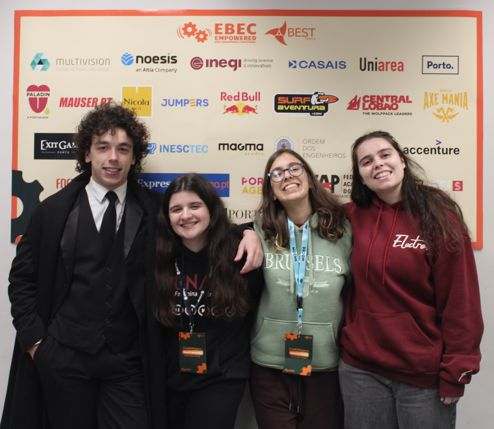

# EBEC_Arduino_Autoline

## Overview

This project was developed as part of the **EBEC Challenge '25** in the **Innovative Design** category. The challenge required our team to design and build a **fully functional automated assembly line prototype** within just **24 hours**. The system was designed to perform four key operations:

✅ Transport products from **Zone A to Zone B**\
✅ Place the product inside a box 📦\
✅ Apply a **logo** to the box 🏷️\
✅ **Close** the box completely, ensuring the product was not visible

## System Design

To accomplish these tasks, we implemented a **fully automated** solution using **Arduino** as our main microcontroller. Our prototype integrated the following components:

🔹 **Conveyor Belt:** Used to transport the product and drop it into the box.\
🔹 **Crane System:** Controlled by servo motors to move the box between different stations.\
🔹 **Stamping Mechanism:** Responsible for applying the logo on the box.\
🔹 **LED Indicator:** Blinks at startup to indicate system activation. 💡

## Hardware Components

- **2x Servo Motors** (for crane control)
- **3x DC Motors** (2 for the conveyor belt, 1 for the stamping mechanism)
- **Arduino Microcontroller**
- **LED Indicator**
- **L298N Motor Driver Module** (for motor control)

## Software & Implementation

We programmed the Arduino using **C++**, ensuring smooth **hardware-software integration**. The system was designed to allow **continuous operation**, enabling seamless box replacement when it reached **Zone B**.

Our biggest challenge was **automating the sticker stamping mechanism**. Despite implementing a lever-based system, fine-tuning its precision remained a major obstacle.

## Features

✔ **Fully Automated Operation**\
✔ **Electronic Control via Arduino**\
✔ **Efficient Crane & Conveyor Integration**\
✔ **LED Startup Indicator**

## Challenges & Learnings

- **Time Constraint:** Completing the entire system within 24 hours was intense but rewarding.
- **Precision and Speed of Movements:** Since every action needed to be precise, ensuring both accuracy and speed was a significant challenge.
- **PWM Control Issues:** The PWM signals were not functioning correctly for the motors to control speed, so we had to simulate PWM by manually pulsing the motor control signals to regulate their movement.
- **Hardware-Software Integration:** A great learning experience in embedded systems.

This project was an exciting and challenging experience that pushed our **engineering and problem-solving skills** to the limit. Proud of the dedication and teamwork that made it possible! 🚀

